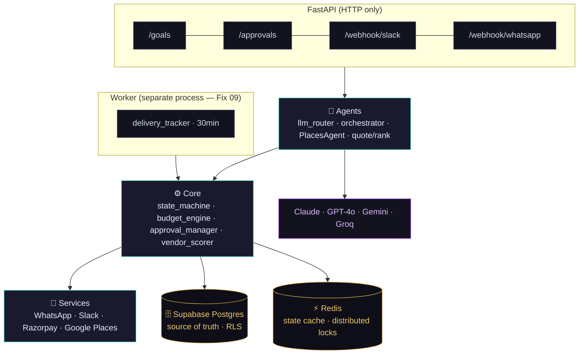

<div align="center">

# 🛒 ProcureOS

### The commercial-execution layer for business procurement

**You type what you need. The agent finds the vendor, gets quotes, takes one approval, pays, and files the invoice.**
*One sentence in → a rated transaction out.*


</div>

---

## The problem

Every business buys things, and the process is broken everywhere: 6+ disconnected tools, a dozen vendor WhatsApp groups, prices copied into spreadsheets (GST forgotten), approvals lost in DMs, and a month-end scramble for invoices. The pain isn't any one category — **it's the fragmentation.**

ProcureOS replaces all of it with a single goal-based interface. An employee says *“order snacks for 50 people in Koramangala”* and an AI agent runs the entire commercial transaction, pausing for exactly **one** human decision: the approval.

> **Two human touchpoints only — _submit_ and _approve_.** Everything between is automated.

---

## How a goal flows

```mermaid
flowchart LR
    E["👤 Employee<br/>plain-language goal"] --> I["🧠 Parse intent<br/>category · qty · budget · GST"]
    I --> D["🔎 Discover vendors<br/>Google Places + vendor graph"]
    D --> R["📨 Dispatch RFQs<br/>WhatsApp, top 3, parallel"]
    R --> Q["💬 Parse quotes<br/>Hinglish · confidence gate"]
    Q --> K["📊 Rank options"]
    K --> A["✅ Approve in Slack<br/>one tap"]
    A --> P["💳 Pay<br/>idempotent · budget-locked"]
    P --> T["🚚 Track delivery"]
    T --> RT["⭐ Rating 👍 / 👎"]
    RT --> S["📈 Vendor score<br/>cross-company graph"]

    style A fill:#2DD4BF,stroke:#0E7490,color:#06303a
    style E fill:#D4A843,stroke:#92651a,color:#2b1d00
    style S fill:#1A1A2E,stroke:#5EEAD4,color:#e8e8ff
```



Each step is a real module, wired end-to-end behind `POST /goals`. The pipeline is **event-driven**: vendor replies arrive on the WhatsApp webhook and the approval arrives from Slack, each resuming the goal through a Redis-locked state machine.

---

## Architecture



- **API and worker are always separate processes** — APScheduler never runs inside the web workers.
- **Supabase is the source of truth; Redis is a cache** + the lock layer. On Redis loss, state is read back from Postgres.
- The backend connects to Postgres as a privileged role (bypasses RLS by design) and enforces tenant isolation in code; **RLS guards the client path.**

---

## Engineering rigor — the binding fixes

Before any feature code, five non-negotiable correctness fixes were implemented and unit-tested. They're what make autonomous money-movement safe:

| Fix | Guarantees | Lives in |
|----:|------------|----------|
| **01** | **Idempotent payments** — deterministic key per order; a timeout retry never double-charges | `services/payment.py` |
| **02** | **Atomic budget re-check** under a Redis distributed lock at payment time | `core/budget_engine.py` |
| **03** | **GST card buffer** (×1.28) so a card never declines when the invoice adds tax | `core/budget_engine.py` |
| **04** | **Approval TTL** — stale options (e.g. flight prices) are re-fetched, not paid on | `core/approval_manager.py` |
| **05** | **Distributed state lock** — every goal transition is a Redis compare-and-set, so the worker and a webhook can't clash | `core/state_machine.py` |

Plus: a **multi-model LLM router** with per-provider circuit breakers and fallback chains (Claude / GPT-4o / Gemini / Groq); a **quote confidence gate** (Fix 13) that routes ambiguous prices to a human; a **cross-company vendor score** (5 weighted signals) that gets smarter with every rated order; and **idempotent delivery** so a duplicate webhook can't create a second rating.

---

## Tech stack

| Layer | Choice |
|---|---|
| API / async | **FastAPI**, Pydantic, Uvicorn |
| Data | **Supabase Postgres** via **asyncpg**; 17 SQL migrations + a raw-SQL runner |
| State & locks | **Redis** (goal state cache, distributed locks) |
| Background jobs | **APScheduler** (separate worker process) |
| LLMs | **Anthropic Claude**, OpenAI, Google Gemini, Groq — behind one router |
| Discovery | **Google Places** (+ internal vendor graph) |
| Messaging | **WhatsApp** via Chat Mitra (BSP), **Slack** approvals |
| Payments | **Razorpay** (test mode) |
| Tests | **pytest** + pytest-asyncio (112 passing) |

---

## Project structure

```
api/         FastAPI app + routes (goals, approvals, webhooks)
agents/      llm_router · orchestrator (GoalProcessor) · specialists · prompts
core/        state_machine · budget_engine · approval_manager · vendor_scorer
             rating · delivery · waba_router · db (InMemory + Supabase stores)
services/    whatsapp · slack_notifier · payment · google_places
worker/      APScheduler entrypoint + jobs (separate process)
migrations/  17 ordered SQL migrations + apply.py runner
supabase/    JWT-claims Edge Function · RLS · storage · indexes
scripts/     test_core_loop.py (single-file demo) · verify_supabase.py (smoke test)
tests/       unit + integration (112 tests)
```

---

## Quickstart

### 1 · Run the tests — no external services needed
```bash
python3.12 -m venv .venv
.venv/bin/pip install -r requirements-dev.txt
.venv/bin/python -m pytest            # 112 pass; live-Redis test skips if no Redis
```

### 2 · See the agent loop run (needs one LLM key)
```bash
cp .env.example .env                  # add GROQ_API_KEY and/or ANTHROPIC_API_KEY
python -m scripts.test_core_loop      # intent → discover → RFQ → quote → rank, live
```

### 3 · Stand up the database (needs live Supabase)
```bash
python -m migrations.apply            # applies 001–017 in order (raw SQL, not Alembic)
python -m migrations.apply --status   # show applied vs pending
python -m scripts.verify_supabase     # smoke-test every store method against the schema
```
Then deploy the Edge Function + storage + indexes — see [`supabase/README.md`](supabase/README.md).

### 4 · Run the platform
```bash
docker compose up                     # api :8000 · worker · redis
curl localhost:8000/health
```

---

## API surface

| Method | Endpoint | Purpose |
|---|---|---|
| `POST` | `/goals` | Submit a procurement goal → runs the pipeline (`202`) |
| `GET` | `/goals/{id}` | Goal status, ranked options, quotes collected |
| `POST` | `/approvals/{id}/approve` · `/reject` | Magic-link sign-off (Fix 12) |
| `POST` | `/webhook/slack` | Approve / reject buttons (HMAC-verified, Fix 11) |
| `GET`·`POST` | `/webhook/whatsapp` | Inbound vendor quotes + ratings (Fix 06 routing) |
| `GET` | `/health` | Liveness |

All responses use a standard envelope: `{ "success", "data", "error" }`.

---

## Status & roadmap

| Phase | Scope | State |
|---|---|---|
| **1 — Foundation** | Structure, 17 migrations, Supabase setup, Fixes 01–05 | ✅ Complete |
| **2 — Core loop** | LLM router, discovery, RFQ, quotes, ranking, Slack approval, payment, delivery, rating, vendor score, `GoalProcessor`, SupabaseStore | ✅ Wired end-to-end |
| **3 — Auth & company** | Supabase Auth, onboarding, roles | ⬜ Next |
| **4 — Everything else** | Governance engine, full notifications, fallback ladders | ⬜ Planned |

**Toward a live demo:** Razorpay (test-mode) payment client · Chat Mitra WhatsApp adapter · demo seed + runbook.

---

<div align="center">
<sub>India-first · built clean-room from the spec · every payment path adversarially reviewed.</sub>
</div>
